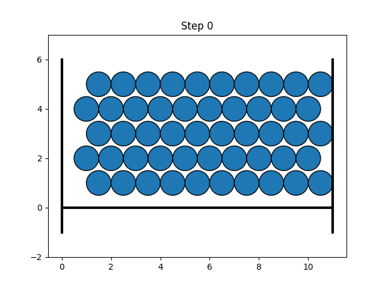
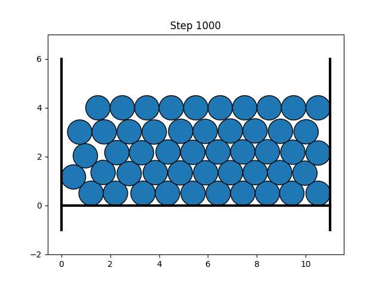
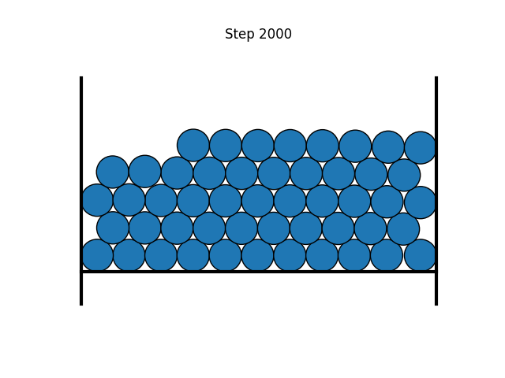

# learning_solving_method
在这里我们使用了Galerkin方法和FDM方法求解了方程，并且对比了方程的求解结果。

中文解说参考 [Here](https://zhuanlan.zhihu.com/p/622256859)

# Deep Ritz方法

## 求解颗粒系统 Particle systems

|  |  |
|:--:| :--:| 
| **Initial state** |**Optimized 1000 steps**|
|  |  |
| **Optimized 2000 steps** |**Optimized 3000 steps**|

